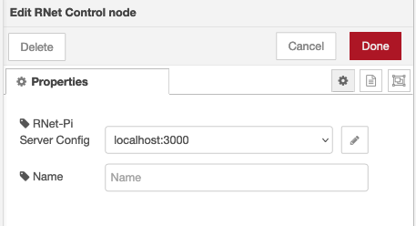
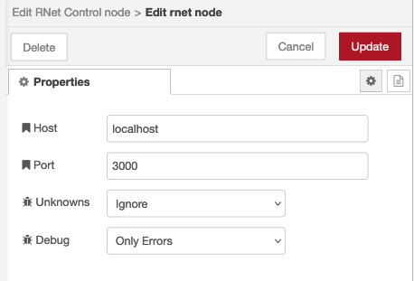
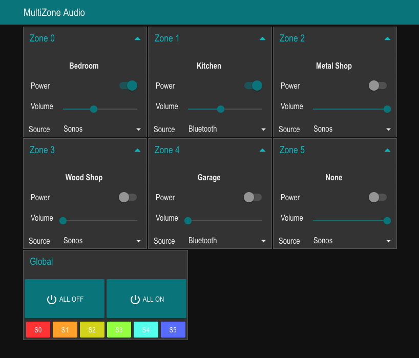
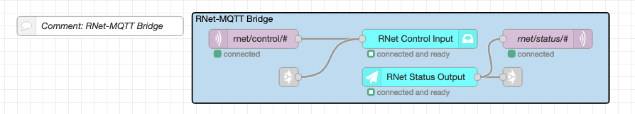
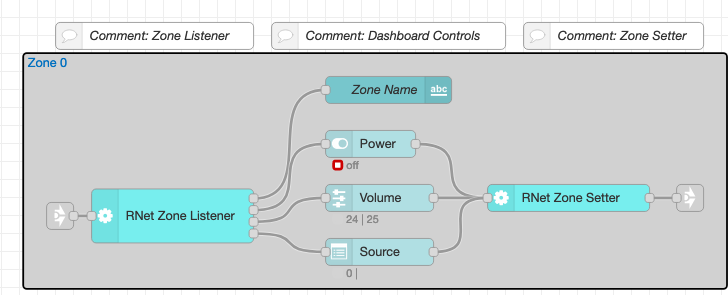
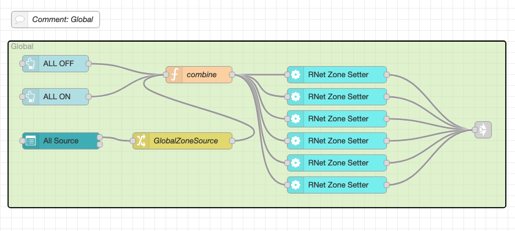

# node-red-rnet-client

## Introduction

This project is a Node RED node that talks to the RNet-Pi server written by Zach Cheatham. The RNet-Pi server connects to legacy Russound RNet whole-house audio systems (e.g. CAA66) over a serial port.  It provides a TCP/IP socket interface for apps and automation software to control the Russound systems.  Included as part of the project is a nice Android app which provides simple, yet powerful control over the Russound systems.

## Prerequisites

### RNet-Pi Server

You must install and run the RNet-Pi server, typically on a device like a Raspberry Pi.  You can find the original sources on GitHub, or choose to run one of the forks which may have additional features or bug fixes.  You will also need a functional USB-to-serial converter, or a native serial port with proper RS232 level shifting.

GitHub:
[https://github.com/zachcheatham/rnet-pi](https://github.com/zachcheatham/rnet-pi)

Follow the instructions for the server, and make note of the configuration settings that you use.  You will need to enter some of these settings into your Node RED configuration.  Be sure the server is working properly using the app, before attempting to use it with Node RED.

Note: It's best to set up names for all sources and all zones, even if you are not using all of them.  If you don't do this, you may encounter problems with the app or the Node RED integration.

### Node RED Dashboard & Controls

You must install the node-red-dashboard node to use the example.  You can do this through the "Manage Palette->Install" option in the menu.

## Installing on Node RED

Install the node-red-rnet-client node from the palette manager, just as you would install any other 3rd party node.  When installed, you will see a new section in your node paletted called "RNet," which contains four new node types.

### RNet Status & RNet Control

The RNet Status node will output MQTT-like messages based on status updates from the RNet-Pi server.  You can directly inject these messages into an MQTT broker, or connect them to other nodes and logic to accomplish your automation.  This allows your Node RED flow to know about changes that occur in your RNet Russound system, in real-time.

The RNet Control node takes MQTT-like messages from your automations and translates them to packets that the RNet-Pi server understands  This allows your Node RED flows to control your RNet Russound system.

#### Configuring

You will need both an RNet Control and an RNet Status node in your flows to fully interoperate with your RNet device.  There is a configuration node that is shared between Control and Status nodes, which contains the IP address/hostname and port of your RNet-Pi server.

Edit either the Control or Status node, and click on the pencil icon next to the "RNet-Pi Server Config" section.  This will allow you to create an initial config to point to your RNet-Pi server.

The config itself is very simple, consisting of a host and port for your RNet-Pi node server.  These values should come from the configuration you did earlier when you set up RNet-Pi on your system.

Two other settings are for developer purposes - __Unknowns__ and __Debug__.  You can safely leave these alone if you are not a developer.

### RNet ZoneSetter

The RNet ZoneSetter node is a helper node for building dashboards that work with RNet.  It provides an easy way for dashboard controls for Zone power, volume and source selection to generate proper messages for the RNet Control node.

Each ZoneSetter node needs to have a controller ID and a zone ID associated with it.

### RNet ZoneListener

The RNet ZoneListener node is a helper node for building dashboards that work with RNet.  It provides a way for changes in the RNet system to set the value of dashboard controls for Zone name, power, volume, and source selection.

Each ZoneListener node needs to have a controller ID and a zone ID associated with it.

## Examples

### Dashboard Example

Included in the distribution is a dashboard example that provides a simple 6-zone controller.  For each of the six zones, power, volume and source selection are provided.  There are also global command examples which can turn your entire system on/off, or set the same source in all zones.

#### Installation & Configuration

To use the example, click the Node RED menu (upper right) and select Import.  Then choose "Examples" and select "node-red-rnet" from the list.  You should see the "Dashboard Example" in the list.  Select this, and select "Import to New Flow" below.  Finally, click "Import," and a new Flow will be created.

Configure the RNet Control Input (or Status Output, since they are shared) server settings for your RNet Pi server.

If you have an MQTT broker in your system, you'll also need to adjust the MQTT settings.  You can also choose to delete the MQTT nodes if you do not use MQTT - the example dashboard will still work.

#### Link Nodes

For a cleaner look, the example makes extensive use of Link In and Link Out nodes to connect zone control/status to the individual dashboard elements.  If you highlight one of the links (small, gray boxes with arrows), you will see dashed lines showing the 'virtual' connections for messages to flow.

#### Anatomy of a Zone

The controls for an individual zone are simple.  A text name for the zone is displayed, and there are controls for power, volume and source.

Zone Name is presently display-only, so it only has a connection to the RNet ZoneListener.

Power, volume and source are both user-controlled and will also reflect status if it changes asynchronously (e.g. another household member turning a zone on or off).  Thus, these controls have both an input from the ZoneListener, and an output to the ZoneSetter.

If you want to cut and paste the nodes inside of the Zone grouping, the controller ID and zone ID both must be set in the ZoneListener and ZoneSetter.  This is how the nodes know what zone status to listen to, and how it know what zone to send command updates to.  Individual controls do not need to have configuration changes made to them, however if you cut and paste the contents of the Zone group, the controls will need to be relocated to the correct dashboard grouping.

#### Global

An example of a basic way to provide "global" commands that apply settings to all zones is shown at the bottom of the example flow.

This is a very simplistic approach that sends multiple commands when power or source settings are changed, and does not take advantage of any RNet features which allow zone grouping.

## Protocol Message Format

### Control Messages

All control messages have a topic that is prefixed with `rnet/control`.

#### Zone control messages

Zone control messages have a topic prefixed with `rnet/control/Zone` that is followed with either a zone ID (`0-5`, first controller is assumed) or an optional controller ID and zone ID separated by a colon (e.g. `0:1` is the first controller, 2nd zone).  The topic must have a suffix which indicates the actual control command, as below:

- `/Power` - control zone power.  Payload is a boolean, `true`=power on, `false`=power off.
- `/Volume` - control zone volume.  Payload is a number for volume, with 0 being the lowest volume.  Max volume for a zone is provided by a status message.
- `/Source` - control zone source.  Payload is a number for source ID, `0-5`.  Source name to ID mapping is provided by status message.

At the present time, only the bare minimum of control commands are implemented.  Many items will appear as status messages which have no means of control.  This will be improved in future versions.

### Status Messages

All status messages have a topic prefixed with `rnet/status`.

#### System-wide property status messages

- `/Property/SystemName` - name of the RNet system.  Payload is a string.
- `/Property/Version` - version of the RNet-Pi server.  Payload is a string.
- `/Property/SerialConnected` - status of the serial connection to the Russound device.  Payload is a boolean.
- `/Property/WebServerEnabled` - status of the web server in the RNet-Pi server.  Payload is a boolean.
- `/Property/ID-###` - unparsed property value, `###` will be replaced by the property ID.  Payload is a string.

#### Zone Index

- `/ZoneIndex` - index values of all known zones.  Payload is a list of numbers.  In practice this will always contain the numbers 0 through 5.

#### Source Status

- `/Source/[source ID]/Name` - name of the source [source ID].  Payload is a string.
- `/Source/[source ID]/MediaPlayState` - play/stop state of media for source.  Payload is a boolean.

#### Zone Status

Zone status messages have have a topic prefixed with `rnet/status/Zone` that is followed with either a controller ID and a zone ID separated by a colon.  The topic will contain a suffix as below to indicate specific zone status information.

- `/Name` - name of the zone.  Payload is a string.
- `/Power` - power status of the zone.  Payload is a boolean.
- `/Volume` - volume status of the zone.  Payload is a number indicating volume level.
- `/MaxVolume` - maximum volume allowed for the zone.  Payload is a number.
- `/Mute` - mute status for zone.  Payload is a boolean.
- `/Source` - source ID for the zone.  Payload is a number indicating source ID (0-5).
- `/Parameter/Loudness` - loudness enable for zone.  Payload is a boolean.
- `/Parameter/DoNotDisturb` - DnD status for the zone.  Payload is a boolean.
- `/Parameter/PartyModeEnable` - Party status for the zone.  Payload is a boolean.
- `/Parameter/FrontAVEnable` - AV Enable status for the zone.  Payload is a boolean.
- `/Parameter/ID-###` - unknown parameter ID for the zone.  Payload is a number.

